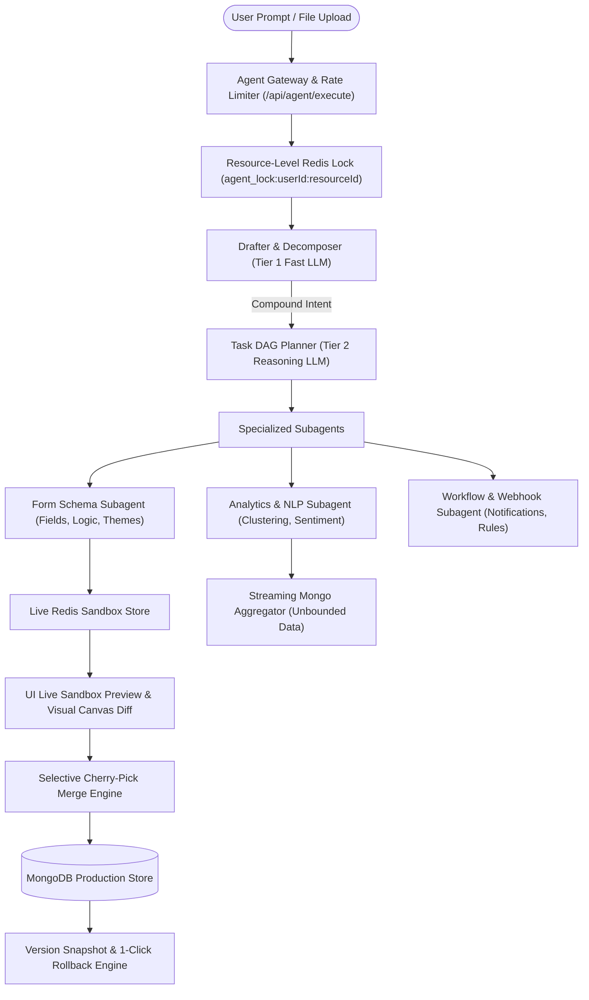

# Easy Forms — AI Agent Upgrade & Implementation Plan (`agy_implementation_plan.md`)

## 1. Executive Vision & Target Architecture

This implementation plan outlines the engineering roadmap to resolve all architectural, functional, security, and user-experience gaps in the Easy Forms AI Agent. 

The upgraded agent moves from a **strictly linear, single-intent pipeline** to a **hierarchical, DAG-based multi-agent orchestrator** with interactive live sandbox previewing, granular merge control, semantic analytics, enterprise RBAC, tiered LLMOps, and multimodal form generation.

---

## 2. Phase-by-Phase Implementation Roadmap

---

### Phase 1: Compound Intent Orchestration & DAG Execution

#### Goal
Enable the agent to handle complex multi-step user prompts (e.g. *"Analyze last week's customer feedback, extract common complaints, and build a new satisfaction survey with conditional follow-ups"*), execute independent tools in parallel, and eliminate global lock contention.

#### Key Enhancements
1. **Hierarchical Intent Decomposer (`src/agent/personas/drafter.ts`):**
   - Upgrade the Drafter to output an array of sub-tasks `tasks: Array<{ id: string; skill: string; prompt: string; dependsOn?: string[] }>`.
   - If a prompt has multiple distinct intents, formulate an execution Directed Acyclic Graph (DAG).
2. **DAG Task Orchestrator (`src/agent/agentLoop.ts` & `src/agent/dag/dagRunner.ts`):**
   - Execute independent sub-tasks concurrently using `Promise.allSettled`.
   - Maintain state across dependent nodes (e.g., pass analytics output from Node 1 as context into Form Builder Node 2).
3. **Resource-Level Granular Locking (`src/agent/sandbox/agentLock.ts`):**
   - Replace global `agent_lock:{userId}` with granular keys `agent_lock:{userId}:{targetResourceId || 'global'}`.
   - Allow concurrent read-only queries and multi-form editing across separate browser tabs.
4. **Drafter Backtracking & Dynamic Replanning:**
   - If the Evaluator determines a fundamental requirement mismatch, allow routing back to the Drafter with `activePersona: "DRAFTER"` instead of repeatedly re-running the Planner.

#### Target Files & Artifacts
- `src/agent/dag/dagRunner.ts` *(New: DAG topological execution engine)*
- `src/agent/personas/drafter.ts` *(Upgrade: multi-intent extraction)*
- `src/agent/personas/planner.ts` *(Upgrade: dependency-aware action graph)*
- `src/agent/sandbox/agentLock.ts` *(Refactor: resource-scoped locks)*

---

### Phase 2: Interactive Sandbox, Granular Merging & 1-Click Rollback

#### Goal
Empower users to interactively preview, test-fill, and selectively merge sandbox changes, with full version history and instant rollback safety.

#### Key Enhancements
1. **Live Sandbox Form Preview (`src/components/ActionBar/SandboxPreviewModal.tsx`):**
   - Create a dedicated modal that mounts the actual `FormRenderer` component against the sandboxed Redis schema (`sandbox:{userId}:{ticketId}`).
   - Allow users to test validations, fill dummy data, and preview responsive layouts before merging.
2. **Selective Cherry-Pick Merge (`src/agent/sandbox/sandboxMerge.ts` & `AgentConfirmationModal.tsx`):**
   - Update UI modal with checkboxes next to each individual schema diff (e.g., `[x] Add 'Phone Number' field`, `[ ] Modify 'Title'`).
   - Allow the user to approve a subset of actions while discarding unwanted changes.
3. **Form Versioning & 1-Click Rollback Engine (`src/models/formVersionModel.ts` & `src/service/formVersionService.ts`):**
   - Snapshot the complete pre-merge `Form` document into `FormVersion` before executing any update or delete.
   - Expose a "Revert Agent Changes" endpoint (`/api/form/[id]/rollback`) and UI button in the Form History view.

#### Target Files & Artifacts
- `src/models/formVersionModel.ts` *(New: schema versioning collection)*
- `src/service/formVersionService.ts` *(New: snapshot & restore service)*
- `src/agent/sandbox/sandboxMerge.ts` *(Upgrade: selective action merging)*
- `src/components/ActionBar/SandboxPreviewModal.tsx` *(New: interactive preview)*
- `src/components/ActionBar/AgentConfirmationModal.tsx` *(Upgrade: granular checkboxes)*

---

### Phase 3: Expanded Form Tool Palette (Logic, Styling, Webhooks & Steps)

#### Goal
Expand the agent's generative capabilities beyond basic fields to advanced form configurations.

#### Key Enhancements
1. **Conditional Logic Rules Tool (`src/agent/tools/logicTools.ts`):**
   - Add tool `configure_conditional_logic` (e.g., `if element_1 == 'Yes', show element_4; else hide`).
   - Store rules in `Form.elements[].conditions` schema.
2. **Theme & Styling Tool (`src/agent/tools/themeTools.ts`):**
   - Add tool `set_form_theme` (`primaryColor`, `fontFamily`, `borderRadius`, `darkMode`, `customCss`).
3. **Webhooks & Email Notifications Tool (`src/agent/tools/workflowTools.ts`):**
   - Add tool `configure_form_workflow` (`webhookUrl`, `notificationEmails`, `autoResponderTemplate`).
4. **Multi-Step Form Wizard Tool (`src/agent/tools/stepTools.ts`):**
   - Add tool `configure_form_steps` (`steps: Array<{ title: string; elementIds: string[] }>`).

#### Target Files & Artifacts
- `src/models/formModel.ts` *(Update: add `conditions`, `theme`, `workflow`, `steps` fields)*
- `src/agent/tools.ts` *(Update: register new function calling schemas)*
- `src/agent/personas/executor.ts` *(Update: handle workflow and theme sandbox actions)*

---

### Phase 4: Large-Scale Streaming Analytics & Semantic Text Intelligence

#### Goal
Process tens of thousands of submission responses without memory limits, and provide AI-powered sentiment analysis and thematic clustering over open-ended feedback.

#### Key Enhancements
1. **Streaming Cursor Aggregator (`src/lib/streamingAggregator.ts`):**
   - Replace in-memory `limit: 50` queries with native MongoDB cursor streaming and aggregation pipelines (`$bucket`, `$facet`, `$group`).
   - Stream statistical summaries directly into the Communicator without loading raw response documents into LLM memory.
2. **Unstructured Feedback Semantic Analyzer (`src/lib/sentimentAnalyzer.ts`):**
   - Add tool `analyze_feedback_sentiment` (categorizes text responses into Positive, Neutral, Negative, and extracts key thematic topics).
   - Generate summary charts (Bar chart of sentiments, Word frequency distribution) for the UI.
3. **Cross-Form Comparative Intelligence:**
   - Add tool `compare_forms_performance` (compares completion rates, drop-off points, and response volume across multiple forms).

#### Target Files & Artifacts
- `src/lib/streamingAggregator.ts` *(New: scalable response aggregation)*
- `src/lib/sentimentAnalyzer.ts` *(New: NLP sentiment & topic extraction)*
- `src/agent/tools.ts` *(Update: register analytics tools)*

---

### Phase 5: Enterprise RBAC, Security & Context Governance

#### Goal
Replace static permissions with dynamic Role-Based Access Control and deep PII masking.

#### Key Enhancements
1. **Dynamic RBAC Policy Engine (`src/agent/policy/rbacPolicy.ts`):**
   - Evaluate user roles:
     - **Admin**: Full access (mutations, destructive actions, exports, analytics).
     - **Editor**: Form creation, schema editing, custom views.
     - **Viewer**: Read-only responses and aggregate analytics.
   - Enforce organization-level scoping and custom permission overrides stored in MongoDB.
2. **Deep Semantic PII Redaction (`src/agent/helper/deepRedact.ts`):**
   - Upgrade `redactPII` to apply regex pattern matching (credit cards, SSNs, phone numbers, email addresses) and named-entity masking across **all** free-text response fields before passing data to LLM prompts.

#### Target Files & Artifacts
- `src/agent/policy/rbacPolicy.ts` *(New: dynamic role-based permission checker)*
- `src/agent/helper/deepRedact.ts` *(New: comprehensive PII masking)*
- `src/models/userModel.ts` *(Update: verify role & organization fields)*

---

### Phase 6: Multi-Tier LLMOps, Semantic Caching & Cost Intelligence

#### Goal
Reduce operational LLM costs by 60–80%, lower response latency, and provide exact cost tracking.

#### Key Enhancements
1. **Tiered Model Router (`src/lib/llmRouter.ts`):**
   - **Tier 1 (Fast / Economy):** `gemini-2.5-flash` / `gpt-4o-mini` for Drafter classification, Evaluator pre-checks, and Communicator direct formatting.
   - **Tier 2 (Advanced Reasoning):** `gemini-2.5-pro` / `claude-3-5-sonnet` / `gpt-4o` for Planner schema generation and complex DAG synthesis.
2. **Semantic Prompt Caching (`src/lib/semanticCache.ts`):**
   - Store normalized query embeddings and responses in Redis.
   - Instant cache hits (<50ms) for repeated read/analytics questions.
3. **Exact Provider Rate Card Accounting (`src/lib/costCalculator.ts`):**
   - Dynamically compute cost per token based on exact model names stored in `AgentUsageModel`.

#### Target Files & Artifacts
- `src/lib/llmRouter.ts` *(New: multi-tier model dispatcher)*
- `src/lib/semanticCache.ts` *(New: Redis semantic query caching)*
- `src/lib/costCalculator.ts` *(New: real-time provider pricing table)*

---

### Phase 7: Real-Time Canvas Co-Editing & Multimodal Form Ingestion

#### Goal
Deliver a visual co-pilot experience where the agent directly edits the visual builder canvas, and users can generate forms from uploaded documents.

#### Key Enhancements
1. **Real-Time WebSocket Canvas Co-Pilot (`src/lib/wsServer.ts` & `src/hooks/useAgentWS.ts`):**
   - Stream agent intentions directly to the active form builder canvas.
   - Render animated "ghost fields" on the canvas as the agent plans them, allowing users to watch fields populate in real time.
2. **Multimodal Form Generator (`src/app/api/agent/upload-document/route.ts`):**
   - Accept PDF, PNG, JPEG, or CSV uploads of existing forms or surveys.
   - Pass document images to Gemini Vision / GPT-4o Vision to extract fields, labels, types, and validation rules automatically.

#### Target Files & Artifacts
- `src/hooks/useAgentWS.ts` *(New: real-time canvas synchronization hook)*
- `src/app/api/agent/upload-document/route.ts` *(New: multimodal ingestion endpoint)*
- `src/components/builderWorkbench/FormBuilder.tsx` *(Update: visual ghost field rendering)*

---

## 3. Implementation Schedule & Milestones

| Sprint | Focus Area | Key Deliverables | Risk Level |
| :--- | :--- | :--- | :--- |
| **Sprint 1 (Week 1–2)** | **DAG Orchestration & Granular Locking** | Multi-intent Drafter, DAG task runner, resource-level locking | Medium |
| **Sprint 2 (Week 2–3)** | **Live Sandbox Preview & Rollback** | Sandbox preview modal, selective cherry-pick merge, `FormVersion` rollback | High |
| **Sprint 3 (Week 3–4)** | **Expanded Tool Palette & Logic** | Conditional branching rules, themes, webhooks, multi-step wizards | Medium |
| **Sprint 4 (Week 4–5)** | **Streaming Analytics & NLP** | Cursor aggregation, sentiment & topic analysis, cross-form comparison | Low |
| **Sprint 5 (Week 5–6)** | **Tiered LLMOps & Dynamic RBAC** | Fast/reasoning model routing, semantic cache, deep PII masking, RBAC | Low |
| **Sprint 6 (Week 6+)** | **Canvas Co-Pilot & Multimodal** | WebSocket canvas ghost preview, PDF/image-to-form OCR generation | Medium |

---

## 4. Testing & Validation Strategy

1. **Golden Prompts Regression Suite (`npm run agent:eval`):**
   - Validate 50+ benchmark scenarios covering compound intents, sandbox isolation, conditional logic, and read-only fast paths.
2. **High-Concurrency Load Testing:**
   - Execute simulated concurrent sessions under load to verify resource-level Redis locking and zero-race sandbox merges.
3. **Rollback & Transaction Verification:**
   - Verify that 100% of failed transactions or rollback requests restore MongoDB state cleanly without orphan documents.
4. **End-to-End TypeScript & Lint Checks:**
   - Run `npx tsc --noEmit` and `npm run lint` across all newly created modules.
