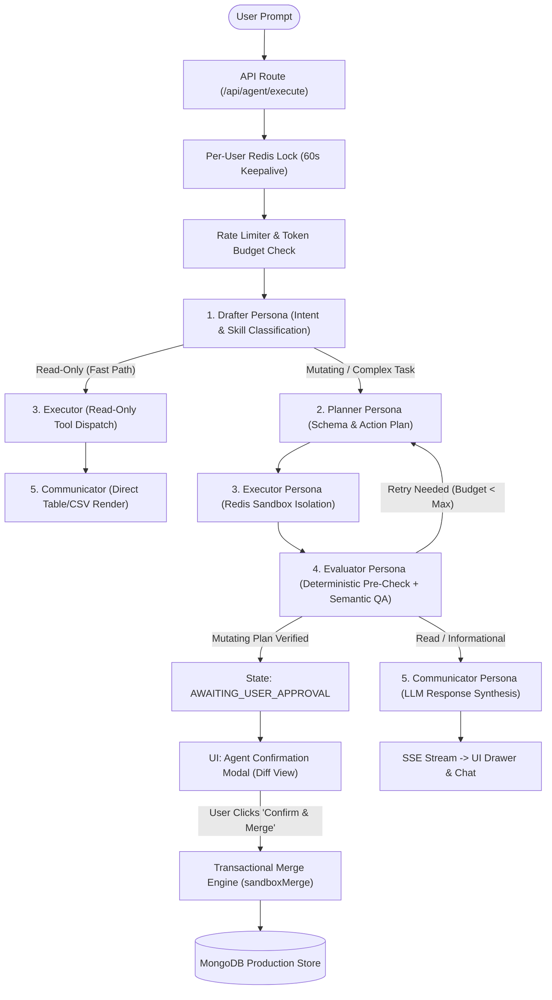

# Easy Forms — AI Agent Architecture & Feature Analysis (`projects_agent.md`)

## 1. Executive Summary & Core Agent Architecture

The **Easy Forms AI Agent** (`src/agent/`) is an autonomous, multi-persona reasoning engine designed to assist users in building forms, editing schemas, generating analytics, querying responses, and safely interacting with application data using natural language.

The agent runs as an isolated state machine driven by `runAgentLoop()` (`src/agent/agentLoop.ts`). It enforces strict invariants:
- **Sandbox Isolation First:** Agent mutations never write directly to production MongoDB; they write to an ephemeral Redis sandbox store (`sandboxRedisStore`).
- **Human in the Loop:** Mutating actions transition to `AWAITING_USER_APPROVAL` and require explicit user confirmation.
- **Read-Only Submission Responses:** Respondent submission data is strictly immutable.
- **Tenant Isolation:** All queries automatically enforce user ownership scoping.

---

## 2. Comprehensive Sub-Feature & Component Breakdown

---

### Feature 1: Drafter Persona (Intent Routing & Classification)

#### 1. Architecture & Mechanism
- **File:** `src/agent/personas/drafter.ts`
- **Role:** First contact persona. Analyzes the incoming user prompt, extracts requirements, classifies the intent into a standardized skill (`build_form`, `edit_form`, `delete_form_skill`, `filter_responses`, `generate_analytics_skill`, `manage_custom_views`, `run_database_query`, `product_guide`, `unsupported`), and verifies permissions against `src/agent/permissions.json`.
- **Fast-Path Optimization:** If the classified skill is in `READ_ONLY_SKILLS`, the Drafter skips the Planner and routes directly to the Executor and Communicator, saving 2 full LLM roundtrips and 60-70% token overhead.
- **Context Injection:** Injects user profile preferences and recent resolved tickets from `AgentTicketModel` to maintain multi-turn dialogue context.

#### 2. Advantages
- **Low Latency for Read Queries:** Read-only requests resolve in a single LLM call (or zero LLM calls for formatted outputs).
- **Early Rejection of Unsupported / Malicious Requests:** Non-form operations and unsupported queries are rejected at the edge without invoking the Planner or Executor.
- **Permission Enforcement:** Checks permission scopes before any downstream execution occurs.

#### 3. Disadvantages
- **Classification Vulnerability:** If the Drafter misclassifies a mutating prompt as read-only (or vice-versa), the pipeline either skips needed planning or unnecessarily triggers the full 5-stage loop.
- **Prompt Token Weight:** Passing recent ticket history into the Drafter increases prompt token counts on long-running sessions.

#### 4. Defects to Fix
1. **Duplicate Code Block:** In `src/agent/personas/drafter.ts` (lines 193–212), the fallback block for handling missing tool arguments in read-only dispatch is duplicated verbatim.
2. **Ambiguous Skill Mapping on Compound Prompts:** If a user submits a compound prompt ("Show me my responses and then create a form"), the single `skill` enum forces a single classification, dropping the secondary intent.
3. **Session vs User Ticket Windowing:** Context lookup fetches recent tickets by `userId` only, meaning separate browser sessions/tabs from the same user interleave ticket histories.

---

### Feature 2: Planner Persona (Tool Call Generation & Parameter Validation)

#### 1. Architecture & Mechanism
- **File:** `src/agent/personas/planner.ts`
- **Role:** Generates an ordered array of executable `AgentAction` objects using OpenAI-compatible function calling schemas (`src/agent/tools.ts`).
- **Validation Guardrails:** Executes `validateToolParams()` prior to returning the action plan to catch malformed field definitions, invalid field type enums (1–5), missing labels, or invalid filter operators.
- **Retry Feedback Context:** Injects the Evaluator's failure diagnosis (`state.evaluatorFeedback`) into subsequent planner iterations to prevent repeating failed plans.
- **Human-Readable Summaries:** Dynamically generates action descriptions (`describeTool()`) displayed on the user's checklist in the UI.

#### 2. Advantages
- **Strict Schema Adherence:** OpenAI tool-calling definitions enforce structured parameter types.
- **Early Parameter Validation:** Catches hallucinated element types or missing fields before the Executor touches Redis.
- **Feedback-Aware Retries:** Retries receive actionable feedback rather than blindly re-prompting.

#### 3. Disadvantages
- **Vendor Specificity:** Function-calling output schemas depend on OpenAI-format endpoints; non-compliant open-weight models require custom fallback parsers.
- **No Dependency Ordering:** The action plan is an array executed linearly; it lacks directed acyclic graph (DAG) dependency resolution for complex multi-resource operations.

#### 4. Defects to Fix
1. **ES Module Resolution in Dynamic Import:** In `planner.ts` line 178, the dynamic import for the legacy Llama3 parser references `../legacy/llama3Fallback.js` with a `.js` extension while the source file is `llama3Fallback.ts`.
2. **Missing Deep Option Validation for Multi-Select:** While select fields (`type: 3`) are checked for `options.length > 0`, options items are not validated for non-empty string labels or value uniqueness.
3. **Action ID Collisions on Multi-Turn Resumes:** If action IDs are generated via timestamp + random number without ticket prefixing, rapid retry loops could theoretically collide.

---

### Feature 3: Executor Persona (Sandbox Isolation & Tool Dispatch)

#### 1. Architecture & Mechanism
- **File:** `src/agent/personas/executor.ts`
- **Role:** Executes the Planner's `actionPlan`.
- **Sandbox Isolation:** Mutating tools (`create_form`, `update_form`, `delete_form`, `create_custom_view`, `update_custom_view`, `delete_custom_view`) are intercepted and written to Redis via `sandboxRedisStore`. They do NOT write to production MongoDB.
- **Optimistic Concurrency Snapshotting:** Before recording an update or delete intention in the sandbox, the Executor queries production MongoDB to snapshot the target document's `_id`, `name`, and `expectedUpdatedAt` timestamp.
- **Read-Only Caching:** Caches read query results in Redis keyed by `(userId, ticketId, actionId)` to ensure determinism across retry iterations.

#### 2. Advantages
- **Zero Production Risk during Planning:** Hallucinations or malformed drafts remain isolated in Redis and expire automatically.
- **Optimistic Concurrency Protection:** Snapshotting `expectedUpdatedAt` guarantees that concurrent user edits made in the web UI will not be blindly overwritten upon merge.
- **Deterministic Retries:** Cached query results prevent LLM drift across iterative loops.

#### 3. Disadvantages
- **Redis Dependency:** High reliance on Redis; if Redis is down or experiences eviction, sandbox state and query caches are lost.
- **Single-Item Mutation Assumption:** Assumes one form or view is mutated per action; does not natively support batch transaction snapshots in the sandbox.

#### 4. Defects to Fix
1. **CustomView Lookup Field Ambiguity:** In `executor.ts` lines 118–124, `findSpec` resolves legacy IDs using `findSpec[isCustomView ? "viewId" : "formId"] = targetId`. However, the `CustomView` model does not possess a `viewId` field; it uses MongoDB `_id` or `formId` (which points to the parent form). This causes lookup failures when updating or deleting custom views by non-ObjectId strings.
2. **Cache Invalidation TTL Absence:** Cached read-only query results in `sandboxRedisStore` have no explicit TTL; if a ticket is reopened days later, stale query results could persist if not explicitly flushed.
3. **Missing Element ID Normalization:** When creating forms in the sandbox, generated element IDs use `field_${Date.now()}_${idx}` which can produce colliding timestamps if generated in rapid synchronous loops.

---

### Feature 4: Evaluator Persona (Dual-Pass Semantic QA & Approval Routing)

#### 1. Architecture & Mechanism
- **File:** `src/agent/personas/evaluator.ts`
- **Role:** Verification and quality assurance engine.
- **Pass 1 (Deterministic Pre-Check):** Checks if any action in `actionPlan` has `status === "error"`. If so, short-circuits directly to retry against the Executor without wasting LLM tokens.
- **Pass 2 (Semantic QA):** Formulates an LLM prompt with redacted action inputs and outputs (`redactPII`), comparing execution results against the original `requirements` and user prompt.
- **Approval Transition:** If mutating actions are present and execution is verified (`verdict.isComplete === true`), transitions `activePersona` to `AWAITING_USER_APPROVAL`.

#### 2. Advantages
- **Dual-Layer Verification:** Fast deterministic fail-first logic prevents unnecessary LLM calls when actions encounter runtime errors.
- **Closed-Loop Feedback:** Provides concrete semantic feedback to the Planner if generated drafts do not fulfill user requirements.
- **Enforced Human-in-the-Loop:** Mutating actions cannot complete without explicit transition to approval state.

#### 3. Disadvantages
- **QA Token Overhead:** Incurs an extra LLM call on every mutating plan.
- **Potential False Negatives:** If the LLM evaluator is overly conservative, it may trigger unnecessary retries up to `maxIterations`.

#### 4. Defects to Fix
1. **Inconsistent Offline Status Handling:** In `evaluator.ts` lines 89–98, when `LLMOfflineError` is caught, the Evaluator routes to `COMMUNICATOR` with `isQuestion: true`, but does not set `state.ticket.status = "LLM_ERROR"` (unlike `communicator.ts`), leaving the MongoDB ticket in `PROCESSING` state.
2. **PII Redaction Truncation on Large Result Sets:** Passing large query results through `redactPII` and `JSON.stringify` in the Evaluator prompt can blow out context limits if the query returned hundreds of items.

---

### Feature 5: Communicator Persona (Response Synthesis & Direct Formatting)

#### 1. Architecture & Mechanism
- **File:** `src/agent/personas/communicator.ts`
- **Role:** Generates the final user-facing response message.
- **Direct Non-LLM Formatting:** For read-only queries (`state.isReadOnly === true`), formats results directly without calling the LLM:
  - $\le 5$ rows: rendered as a Markdown table.
  - $> 5$ rows: rendered as an inline downloadable CSV data URI (`data:text/csv;charset=utf-8,...`).
- **Latency Compensation:** If server processing latency exceeds 10,000ms, injects a polite server load notice into the prompt.
- **Prewritten Drafter Preservation:** If the Drafter already provided a concise reply (e.g. for product guides or validation queries), uses it as the response foundation.

#### 2. Advantages
- **Zero Token Cost for Read Results:** Standard queries and exports produce formatted UI tables and CSVs without spending LLM tokens.
- **User-Friendly Error Formatting:** Catches `LLMOfflineError` and presents actionable instructions to the user.
- **Adaptive Latency Communication:** Keeps user informed when high server load delays responses.

#### 3. Disadvantages
- **Browser Memory Limits on Data URIs:** Embedding large CSV strings into `data:text/csv` URLs can cause browser performance degradation or URL truncation on multi-megabyte datasets.
- **Static Table Formatting:** Nested objects in response fields are stringified into `[object Object]` in the direct table renderer.

#### 4. Defects to Fix
1. **Data URI Encoding Crash on Unescaped Characters:** In `communicator.ts` line 36, `encodeURIComponent(csv)` is used directly on unescaped values containing special delimiters or raw quotes, which can generate corrupt CSV rows.
2. **Missing Sanitization of Markdown Table Dividers:** In `formatReadOnlyResults()`, if field values contain pipe characters (`|`), they break the generated Markdown table syntax.

---

### Feature 6: Memory & State Persistence (Mongo Tickets & Redis Cache)

#### 1. Architecture & Mechanism
- **Files:** `src/models/agentTicketModel.ts`, `src/agent/sandbox/agentRedis.ts`, `src/agent/sandbox/sandboxRedisStore.ts`
- **Two-Tier Persistence:**
  1. **Authoritative Storage (MongoDB):** `AgentTicketModel` records the full lifecycle (`OPEN`, `PROCESSING`, `AWAITING_USER_APPROVAL`, `RESOLVED`, `REJECTED`, `LLM_ERROR`), requirements, actions, traces, and token usage.
  2. **Fast Ephemeral Cache (Redis):** Caches active tickets with TTL for low-latency resume and SSE updates.
- **Sliding History Window:** Retains the last 10 user/assistant turns in memory to provide context without overloading token budgets.

#### 2. Advantages
- **Crash Recovery & Resumability:** If an agent stream drops or the server restarts, the ticket state in Mongo allows seamless resumption via `resumeTicketId`.
- **Complete Audit Trail:** Persists full execution traces (`ExecutionTraceStep[]`) and token metrics for administrative auditing.

#### 3. Disadvantages
- **Dual-Write Consistency Challenges:** Writing to both MongoDB and Redis creates potential race conditions if one store fails mid-loop.

#### 4. Defects to Fix
1. **Ticket Status Invalidation on Abandoned Approval:** If a user closes their browser while a ticket is in `AWAITING_USER_APPROVAL`, the ticket remains in that state indefinitely in MongoDB without an automatic expiration or stale-lock reaper.
2. **Trace Array Memory Bloat:** While `executionTrace` is capped at 50 entries in memory, large payload JSON strings could temporarily consume excess memory before being sliced.

---

### Feature 7: Sandbox Store & Production Merge Engine

#### 1. Architecture & Mechanism
- **Files:** `src/agent/sandbox/sandboxRedisStore.ts`, `src/agent/sandbox/sandboxMerge.ts`
- **Transactional Merge:** Uses MongoDB replica-set transactions (`mongoose.ClientSession.withTransaction`) to merge forms, update intentions, and delete intentions in a single atomic commit.
- **Idempotency Protection:** Enforces a sparse unique index on `agentIdempotencyKey` in `Form` and `CustomView` models using `$setOnInsert` to guarantee re-merges are safe no-ops.
- **Two-Phase Standalone Fallback:** If the MongoDB instance is a standalone without replica-set support, falls back to `mergeSandboxToProductionStandalone()` utilizing the `PendingMerge` collection.
- **Audit Logging:** Emits `AgentAuditEvent` records for every created, updated, or deleted resource.

#### 2. Advantages
- **Atomic Rollback:** If any mutation fails during merge, the MongoDB transaction aborts, the Redis sandbox is preserved, and the user can safely retry without data corruption.
- **Idempotent Retries:** Network double-clicks or repeated API calls cannot create duplicate production forms.
- **Zero Production Risk:** Destructive changes only execute after explicit human review.

#### 3. Disadvantages
- **Replica Set Requirement for True Atomicity:** Full ACID guarantees require MongoDB replica sets; standalone fallback is best-effort.
- **Redis TTL Risk:** If the user takes longer than the Redis sandbox TTL to click "Confirm & Merge", the sandbox draft may expire.

#### 4. Defects to Fix
1. **`_id: undefined` in Upsert Query:** In `sandboxMerge.ts` lines 68–70, `_id: undefined` is passed inside `$setOnInsert`. In certain Mongoose/MongoDB driver versions, passing `_id: undefined` can cause MongoDB to attempt casting undefined or omit generating a fresh ObjectId.
2. **Missing UI Concurrency Conflict Details:** When an optimistic concurrency check fails (`concurrency_miss`), the merge stats record `updatesMissed++`, but the final message returned to the user does not specify which specific form had conflicting changes.

---

### Feature 8: Distributed Locking & Concurrency Control (`agentLock`)

#### 1. Architecture & Mechanism
- **Files:** `src/agent/sandbox/agentLock.ts`
- **Mechanism:** Acquires a Redis lock `agent_lock:{userId}` with a 60-second TTL using `SET key token NX PX 60000`.
- **Auto-Renewal Keepalive:** Launches an internal 10-second interval timer that extends the lock TTL as long as the agent loop is actively executing.
- **Contention Prevention:** Throws `AgentBusyError` if a concurrent request is received for the same user, which `src/app/api/agent/execute/route.ts` converts to a clean HTTP 409 / typed SSE event.

#### 2. Advantages
- **Prevents Race Conditions:** Eliminates double-submission races from rapid UI clicks, multiple browser tabs, or webhook retries.
- **Self-Healing:** If the Node process crashes, the 60s TTL guarantees the lock expires automatically without permanent deadlocks.

#### 3. Disadvantages
- **User-Level Scope Contention:** Locking is scoped per `userId` rather than `(userId, formId)`. A user cannot run an analytics query on Form A while editing Form B in another tab.
- **Keepalive Timer Leak on Unhandled Crashes:** If an asynchronous promise hangs without throwing, the keepalive timer could keep renewing the lock until manual process termination.

#### 4. Defects to Fix
1. **Unscoped Lock Granularity:** Lock key `agent_lock:{userId}` blocks all concurrent agent requests for a user, even when requests target completely unrelated forms or are pure read-only operations.
2. **Lock Release Error Suppression:** In `agentLock.ts`, if `del` fails during release due to Redis network blip, the error is logged but not propagated, which can mask infrastructure issues.

---

### Feature 9: LLMOps, Resilience, & Token Budgeting

#### 1. Architecture & Mechanism
- **Files:** `src/lib/llmClient.ts`, `src/lib/llmHealthMonitor.ts`, `src/models/agentUsageModel.ts`
- **Provider Support:** Supports OpenAI, Anthropic, Ollama, and custom OpenAI-compatible endpoints via unified interface.
- **Exponential Backoff:** `retryLLM()` handles transient HTTP 429, 500, 502, 503, and 504 errors with jittered exponential backoff (up to 3 attempts).
- **Token Budget Guard:** Enforces strict limits:
  - Per-Ticket Budget: `50,000` tokens (env: `LLM_TOKEN_BUDGET_PER_TICKET`).
  - Daily Per-User Budget: `200,000` tokens (env: `LLM_TOKEN_BUDGET_PER_USER_DAY`).
- **Telemetry & Health Stream:** Real-time health monitoring and SSE ping stream at `/api/agent/health-stream`.

#### 2. Advantages
- **Cost & Quota Protection:** Hard token caps prevent runaway loops or denial-of-wallet attacks.
- **Provider Agnostic:** Easily swappable between cloud providers and local models (Ollama).
- **High Fault Tolerance:** Transparently recovers from momentary LLM rate limits or network drops.

#### 3. Disadvantages
- **Simplified Cost Model:** Token cost calculation uses a static formula (`$0.0001 / 1k tokens`) rather than exact model-tier pricing tables.
- **Prompt Token Amplification:** Re-sending full action schemas and persona prompts on every iteration increases token consumption.

#### 4. Defects to Fix
1. **Hardcoded Model Pricing:** `costUsd` calculations in `agentLoop.ts` and `agentUsageModel.ts` do not differentiate between GPT-4o, Claude 3.5 Sonnet, or local Ollama instances (which have $0 cost).
2. **Health Monitor Ping Frequency:** `llmHealthMonitor` triggers background health checks that can consume rate-limit quota if pointed at metered cloud endpoints with strict RPM limits.

---

### Feature 10: Frontend UI & Real-Time Interaction Layer

#### 1. Architecture & Mechanism
- **Files:** `src/components/ActionBar/AIbar.tsx`, `src/components/ActionBar/AgentSidebarDrawer.tsx`, `src/components/ActionBar/AgentConfirmationModal.tsx`, `src/components/AgentVisualizer/AgentVisualizer.tsx`
- **Real-Time Streaming:** Connects to `/api/agent/execute` via `EventSource` (SSE) to receive real-time persona state transitions and execution trace updates.
- **Sci-Fi Interactive AI Bar:** Floating prompt bar with interactive command history (Up/Down arrow navigation), speech bubbles, and online/offline status indicators.
- **Side Drawer:** Displays real-time persona pipeline status (Drafter $\rightarrow$ Planner $\rightarrow$ Executor $\rightarrow$ Evaluator $\rightarrow$ Communicator), expandable trace logs, and action checklist.
- **Confirmation Modal:** Displays visual schema diffs (added fields, modified properties, removed elements) before the user confirms a merge.

#### 2. Advantages
- **Exceptional User Transparency:** Users can see exactly which persona is thinking, what tools are being executed, and review full diffs before committing changes.
- **Responsive & Accessible:** Polished animations, theme support, keyboard navigation, and responsive drawer layouts.

#### 3. Disadvantages
- **EventSource Header Limitations:** Standard browser `EventSource` does not support custom Authorization headers, requiring session cookies or query parameters.
- **Reconnection Handling:** If the client network disconnects mid-stream, standard `EventSource` may trigger a duplicate request unless explicitly handled.

#### 4. Defects to Fix
1. **SSE URL Query Parameter Leakage:** Prompts containing sensitive information are passed via URL query parameter (`?prompt=...`) in `AIbar.tsx` line 120, which can be logged in server access logs.
2. **Memory Leak in Typewriter Interval:** In `AIbar.tsx` (`TypewriterSpeechBubble`), if `onClose` is triggered while the typewriter interval is running, the interval timer may not be cleared immediately if the prop changes rapidly.

---

## 3. Prioritized Engineering Roadmap & Defect Remediation

| Priority | Component | Defect / Enhancement | Target File |
| :--- | :--- | :--- | :--- |
| **P0 (Critical)** | **Drafter** | Remove duplicated code block in read-only tool dispatch (lines 193–212) | `src/agent/personas/drafter.ts` |
| **P0 (Critical)** | **Executor** | Fix CustomView lookup field mismatch (`viewId` vs `_id`/`formId`) | `src/agent/personas/executor.ts` |
| **P1 (High)** | **Sandbox Merge** | Ensure `_id` removal does not pass `undefined` inside `$setOnInsert` | `src/agent/sandbox/sandboxMerge.ts` |
| **P1 (High)** | **Evaluator** | Explicitly set `ticket.status = "LLM_ERROR"` on `LLMOfflineError` | `src/agent/personas/evaluator.ts` |
| **P1 (High)** | **Communicator** | Sanitize pipe characters (`\|`) in Markdown table formatter to prevent broken formatting | `src/agent/personas/communicator.ts` |
| **P2 (Medium)** | **Planner** | Fix `.js` extension in dynamic import for `llama3Fallback` | `src/agent/personas/planner.ts` |
| **P2 (Medium)** | **Agent Lock** | Granular lock keys by `(userId, formId)` rather than global `userId` | `src/agent/sandbox/agentLock.ts` |
| **P2 (Medium)** | **AIbar UI** | Switch from GET query parameters to POST for agent execution stream | `src/components/ActionBar/AIbar.tsx` |
| **P3 (Low)** | **LLMOps** | Model-specific token pricing calculation in `agentUsageModel` | `src/agent/agentLoop.ts` |
