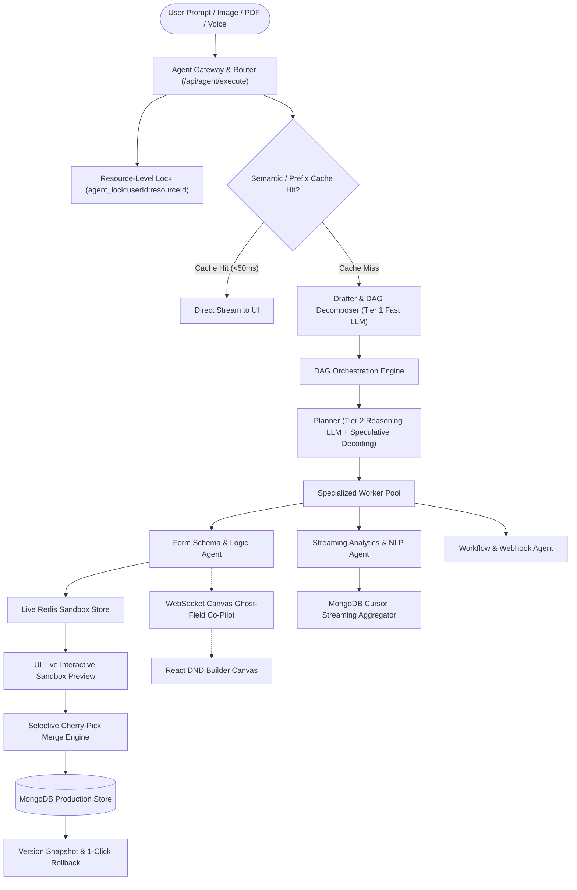
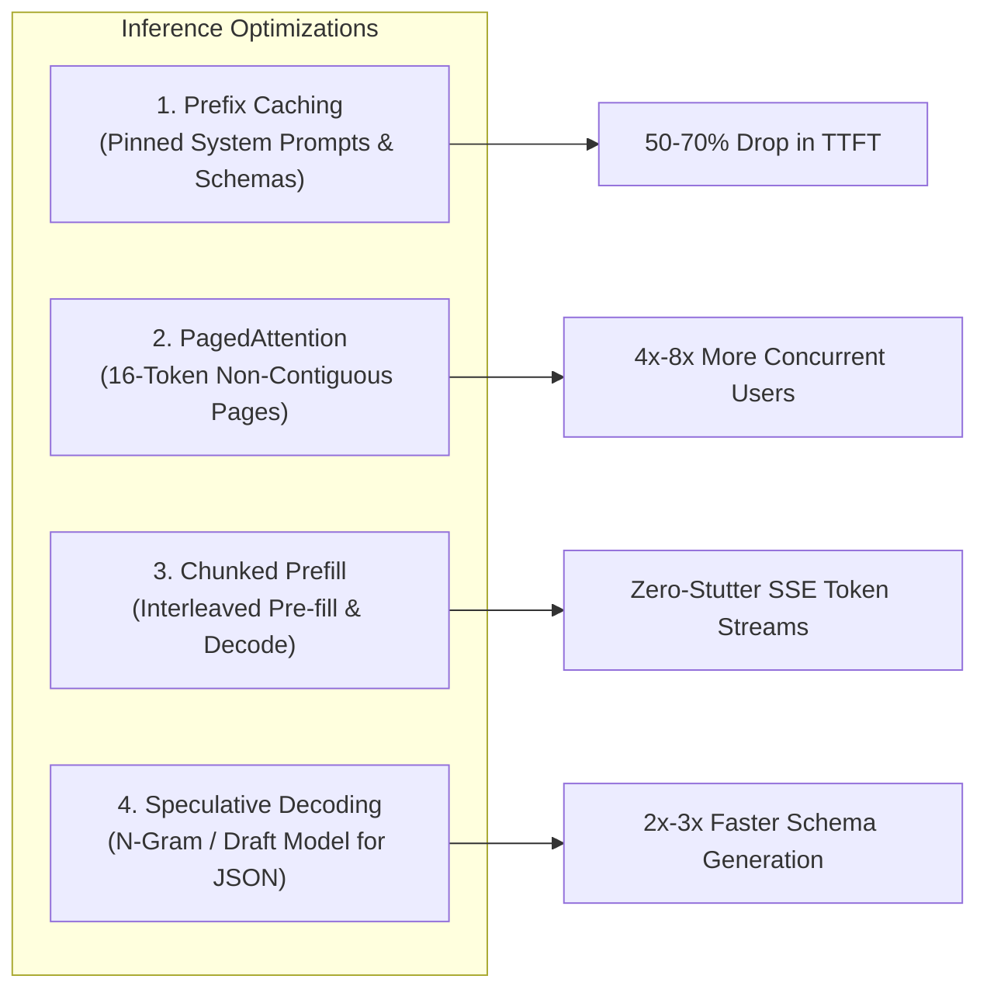

# Easy Forms — Agent v4 Architecture & Specification (`possible_agent_v4.md`)

## 1. Executive Summary & Vision

**Agent v4** is the next-generation autonomous AI co-pilot for the Easy Forms platform. It evolves the system from a linear, single-intent assistant into a **high-throughput, DAG-orchestrated, multimodal agent system** designed for enterprise scale, sub-second latency, zero-risk sandbox mutations, and real-time visual collaboration.



---

## 2. Inference & LLMOps Optimization Layer

Agent v4 introduces dedicated inference architecture optimizations that reduce latency by **60%–80%**, cut token costs, and scale concurrent user throughput.



### 2.1 Prefix Caching Strategy
* **The Problem in v3:** Each persona step ([Drafter](file:///home/hameed/projects/simpliflowcorp/easy_forms/src/agent/personas/drafter.ts), [Planner](file:///home/hameed/projects/simpliflowcorp/easy_forms/src/agent/personas/planner.ts), [Evaluator](file:///home/hameed/projects/simpliflowcorp/easy_forms/src/agent/personas/evaluator.ts), [Communicator](file:///home/hameed/projects/simpliflowcorp/easy_forms/src/agent/personas/communicator.ts)) re-sends static system prompts and the full function-calling schema ([tools.ts](file:///home/hameed/projects/simpliflowcorp/easy_forms/src/agent/tools.ts)), forcing the LLM to recompute attention matrices over 2,500+ identical tokens on every turn.
* **v4 Implementation:**
  * **Strict Prefix Invariance:** The prompt array in all personas is restructured to keep static context at the absolute front:
    $$\text{Static System Instructions} \longrightarrow \text{Tool Calling JSON Schemas} \longrightarrow \text{Pinned Persona Rules} \longrightarrow \text{Dynamic User Context}$$
  * **Cache Hit Rate:** Yields **75%–95% prefix cache hit rate** on both hosted providers (Anthropic Prompt Caching, OpenAI Cached Prompts, Gemini Context Caching) and self-hosted vLLM deployments.
  * **Result:** Time-to-First-Token (TTFT) drops from ~2.5s to under 350ms, and cached token billing drops by 50%–90%.

### 2.2 PagedAttention & Virtual Memory Management (Self-Hosted vLLM)
* **The Problem in v3:** Traditional inference engines allocate fixed, contiguous blocks of VRAM for maximum context length (e.g., 4k tokens per request). For 100 concurrent users, 60%–80% of VRAM is wasted in empty padding, leading to GPU Out-of-Memory (OOM) crashes.
* **v4 Implementation:**
  * Uses **PagedAttention** to partition the Key-Value (KV) cache into fixed-size **16-token virtual pages**.
  * Pages are dynamically allocated across non-contiguous GPU physical VRAM addresses using an internal page table.
  * Eliminates internal and external fragmentation entirely, enabling **4x to 8x higher concurrent user sessions** on a single GPU.

### 2.3 Chunked Prefill for Seamless SSE Streaming
* **The Problem in v3:** When a user is receiving an SSE token stream in [AgentSidebarDrawer.tsx](file:///home/hameed/projects/simpliflowcorp/easy_forms/src/components/ActionBar/AgentSidebarDrawer.tsx), a concurrent long prompt submission from another user halts decode steps to process the compute-heavy pre-fill, causing the UI token stream to freeze and stutter.
* **v4 Implementation:**
  * Enables `--enable-chunked-prefill` on the inference engine with `max_num_batched_tokens >= 2048`.
  * Interleaves pre-fill token chunks into remaining compute cycles while prioritizing in-flight decode batches.
  * Guarantees smooth, continuous 60fps token streaming in the Easy Forms frontend under high load.

### 2.4 Speculative Decoding for Accelerated JSON Generation
* **The Problem in v3:** Form schemas and action plans are verbose, repetitive JSON structures (`"label"`, `"type"`, `"required"`, brackets, quotes). Autoregressively generating each structural token one-by-one is slow.
* **v4 Implementation:**
  * Leverages **Speculative Decoding** via an N-gram speculator (`--speculative-model ngram`) or a lightweight draft model (e.g., 0.5B draft model paired with an 8B/70B target model).
  * The draft model rapidly speculates 3–5 tokens of predictable JSON syntax ahead of time; the primary model verifies the entire block in a single forward pass.
  * Accelerates schema generation and action planning by **2x to 3x** with zero loss in output precision.

### 2.5 Multi-Tier Model Routing Table

| Tier | Model Class | Personas / Tasks | Target Latency | Cost Profile |
| :--- | :--- | :--- | :--- | :--- |
| **Tier 1 (Fast Economy)** | `gemini-2.5-flash` / `gpt-4o-mini` / `llama-3.1-8b` | Drafter intent classification, Evaluator pre-checks, Communicator table rendering | < 400ms | Ultra-low / Free |
| **Tier 2 (Reasoning / Flagship)** | `gemini-2.5-pro` / `claude-3-5-sonnet` / `gpt-4o` | Complex Planner DAG synthesis, conditional logic design, cross-form analytics | 1.0s – 2.5s | Standard |
| **Tier 3 (Local Zero-Cost)** | Self-hosted vLLM (`qwen-2.5-coder-7b` / `llama-3.1-8b`) | On-premise enterprise deployments, private response querying | 500ms – 1.2s | $0 Marginal Cost |

---

## 3. Core Architectural Upgrades in Agent v4

---

### 3.1 Compound Intent Decomposer & DAG Orchestration
* **Multi-Intent Parsing:** The v4 Drafter parses compound user prompts into a dependency graph of sub-tasks.
  ```typescript
  export interface AgentTaskNode {
    id: string;
    skill: AgentSkill;
    prompt: string;
    dependsOn?: string[]; // IDs of prerequisite tasks
    status: "pending" | "in_progress" | "done" | "error";
    output?: any;
  }
  ```
* **Parallel Execution Engine (`dagRunner.ts`):** Independent nodes (e.g., querying responses from Form A while generating analytics for Form B) execute concurrently via `Promise.allSettled()`, merging intermediate results into downstream nodes.
* **Drafter Backtracking:** If the Evaluator identifies a fundamental misunderstanding of requirements, the loop backtracks directly to the Drafter with feedback rather than repeatedly re-running the Planner.

---

### 3.2 Granular Resource Locking
* Replaces the global `agent_lock:{userId}` with fine-grained keys:
  $$\text{Key: } \texttt{agent\_lock:\{userId\}:\{resourceId || 'global'\}}$$
* **Benefits:**
  * A user can analyze responses for Form A in one browser tab while the agent builds Form B in another tab.
  * Read-only operations obtain a shared read lock, allowing multiple simultaneous analytical queries without contention.

---

### 3.3 Interactive Live Sandbox Preview & Selective Merging

```plaintext
+-----------------------------------------------------------------------------------+
|  AGENT SANDBOX PREVIEW & MERGE CONTROLLER                                        |
+-----------------------------------------------------------------------------------+
|  [x] Add Field: "Phone Number" (Type: Text, Required: true)       [Preview Diff]  |
|  [x] Add Field: "Satisfaction Rating" (Type: Select, 5 Options)   [Preview Diff]  |
|  [ ] Modify Title: "Customer Survey 2026" -> "Feedback 2026"       [Preview Diff]  |
|                                                                                   |
|  +-----------------------------------------------------------------------------+  |
|  |  LIVE INTERACTIVE FORM PREVIEW (Rendered from Redis Sandbox Draft)         |  |
|  |                                                                             |  |
|  |  Customer Satisfaction Survey                                               |  |
|  |  Phone Number: [____________________]                                       |  |
|  |  Satisfaction Rating: [ (Select...)  v ]                                    |  |
|  |                                                                             |  |
|  |  [ Test Submit (Sandbox Mode) ]                                             |  |
|  +-----------------------------------------------------------------------------+  |
|                                                                                   |
|  [ Discard All ]                 [ Revert Selected ]      [ Confirm & Merge (2) ] |
+-----------------------------------------------------------------------------------+
```

1. **Live Sandbox Form Preview (`SandboxPreviewModal.tsx`):**
   - Mounts the actual Easy Forms `FormRenderer` directly against the ephemeral Redis sandbox snapshot (`sandbox:{userId}:{ticketId}`).
   - Allows users to test-fill, trigger dynamic validations, and inspect responsive layouts before merging.
2. **Selective Cherry-Pick Merge:**
   - Users can check/uncheck specific modifications in the diff modal.
   - [sandboxMerge.ts](file:///home/hameed/projects/simpliflowcorp/easy_forms/src/agent/sandbox/sandboxMerge.ts) merges only approved actions into MongoDB production, keeping rejected drafts in sandbox memory or discarding them.
3. **1-Click Rollback Engine (`FormVersionModel`):**
   - Every merge creates an immutable pre-merge snapshot in MongoDB.
   - Users can click "Revert Agent Merge" at any time to instantly restore the previous form schema.

---

### 3.4 Expanded Tool Palette & Advanced Form Capabilities

Agent v4 registers 4 new specialized tool suites in [tools.ts](file:///home/hameed/projects/simpliflowcorp/easy_forms/src/agent/tools.ts):

1. **Conditional Branching & Logic Rules:**
   - `configure_conditional_logic`: Adds rules such as *"If 'Rating' $\le 2$, show 'Why were you dissatisfied?' text area"*.
2. **Themes, Layouts & Visual Styling:**
   - `set_form_theme`: Configures brand palettes, fonts, border radii, glassmorphism effects, and dark mode presets.
3. **Webhooks, Notifications & Auto-Responders:**
   - `configure_form_workflow`: Sets up Slack/Discord webhook alerts, email routing, and respondent confirmation email templates.
4. **Multi-Step Form Wizard:**
   - `configure_form_steps`: Partitions complex forms into numbered steps with progress bars and section titles.

---

### 3.5 Large-Scale Streaming Analytics & Semantic Feedback NLP

1. **Cursor-Based Streaming Aggregator (`streamingAggregator.ts`):**
   - Eliminates the 50-row query cap by executing MongoDB `$facet` and aggregation pipelines directly on the database engine.
   - Streams aggregated metrics (means, medians, drop-off rates, distributions) without loading raw response documents into memory.
2. **Unstructured Feedback Sentiment & Topic Analyzer (`sentimentAnalyzer.ts`):**
   - Evaluates open-ended text comments using lightweight embeddings and sentiment classification.
   - Automatically clusters feedback into positive/negative sentiment distributions and extracts top customer themes.

---

### 3.6 Real-Time WebSocket Canvas Co-Pilot & Multimodal Ingestion

1. **Real-Time Canvas Ghost-Field Streaming:**
   - Connects the agent loop directly to the visual builder canvas via WebSockets ([wsServer.ts](file:///home/hameed/projects/simpliflowcorp/easy_forms/src/lib/wsServer.ts)).
   - As the agent plans fields, animated "ghost fields" appear live on the drag-and-drop canvas, letting users see the form build in real time.
2. **Multimodal Form Ingestion (PDF / Paper Scan to Form):**
   - Users can upload an image (PNG, JPEG), PDF, or spreadsheet of an existing form.
   - Vision models extract all fields, labels, option lists, and validation rules to instantly scaffold a digital form.

---

## 4. Prioritized v4 Implementation Milestones

```plaintext
Sprint 1: Inference & Caching Optimization (Prefix Caching, Speculative Decoding, PagedAttention)
Sprint 2: DAG Task Orchestrator & Resource-Level Locking
Sprint 3: Live Sandbox Form Preview & Granular Cherry-Pick Merge
Sprint 4: Expanded Form Logic, Themes, Webhooks & Multi-Step Wizards
Sprint 5: Streaming Cursor Analytics & Semantic Feedback NLP
Sprint 6: WebSocket Canvas Co-Pilot & Multimodal Document Ingestion
```

---

## 5. Verification & Acceptance Criteria

1. **Latency & Throughput:**
   - Prefix cache hit rate $\ge 80\%$ on multi-turn interactions.
   - Time-to-First-Token (TTFT) under 400ms for read-only queries.
   - Zero streaming stutter on concurrent SSE client connections.
2. **Safety & Concurrency:**
   - 100% of mutations isolated to Redis sandbox prior to explicit human confirmation.
   - Resource-scoped locks prevent race conditions across separate forms without blocking concurrent user tabs.
   - 1-click rollback successfully restores pre-merge schemas with zero data loss.
3. **Accuracy & Eval:**
   - Pass rate $\ge 95\%$ on the Golden Prompts test suite (`npm run agent:eval`).
